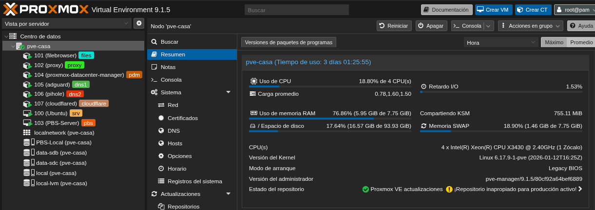
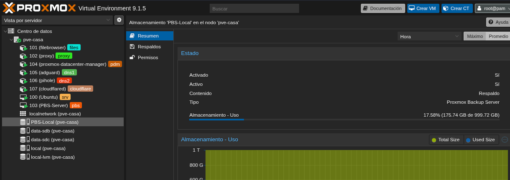

# 🚀 Proxmox Homelab | HP ProLiant ML110 G6
### By Felipe Soluciones IT

Bienvenido a la documentación de mi infraestructura personal. Este repositorio detalla mi transición desde VMware ESXi hacia un ecosistema basado en **Proxmox Virtual Environment 9.1.5**, optimizando el rendimiento de hardware para servicios de red, seguridad y desarrollo.

---

## 🛠️ Hardware Specification
El corazón de este laboratorio es un servidor robusto diseñado para la estabilidad:

* **Modelo:** HP ProLiant ML110 G6
* **CPU:** Intel Xeon X3430 @ 2.40GHz (4 Cores)
* **RAM:** 8 GB DDR3
* **Almacenamiento:** 2.72 TB en configuración RAID
* **Red:** Gigabit Ethernet

---

## 🏗️ Arquitectura de Virtualización
Actualmente, el nodo `pve-casa` gestiona un total de **8 instancias** activas, priorizando contenedores LXC para minimizar el overhead de memoria.

### 🖥️ Máquinas Virtuales (VMs)
| ID | Nombre | Función |
| :--- | :--- | :--- |
| 100 | **Ubuntu (srv)** | Servidor principal de aplicaciones y Docker. |
| 103 | **PBS-Server** | Servidor de backups con disco de 1TB dedicado. |

### 📦 Contenedores (LXC)
| ID | Nombre | Servicio |
| :--- | :--- | :--- |
| 101 | **FileBrowser** | Gestión de archivos vía web. |
| 102 | **Proxy** | Nginx Proxy Manager para acceso externo. |
| 104 | **PDM** | Proxmox Datacenter Manager. |
| 105 | **AdGuard** | DNS Sinkhole y filtrado de publicidad. |
| 106 | **Pi-hole** | Redundancia de bloqueo DNS. |
| 107 | **Cloudflared** | Túnel seguro de Cloudflare para `hardtechsys.tech`. |

---

## 🛡️ Estrategia de Backup (PBS)
La seguridad de los datos es crítica. He implementado **Proxmox Backup Server (PBS)** localmente, lo que permite backups incrementales rápidos y deduplicación de datos.

---

## 🌐 Networking y Seguridad
* **Dominio:** `hardtechsys.tech` gestionado mediante Cloudflare.
* **VPN:** Acceso remoto seguro vía **Netbird** y túneles seguros.
* **Segmentación:** Reglas de firewall aplicadas a nivel de Datacenter y contenedores.

---
**Felipe Soluciones IT** *Técnico en Sistemas | Estudiante de Ethical Hacking*
